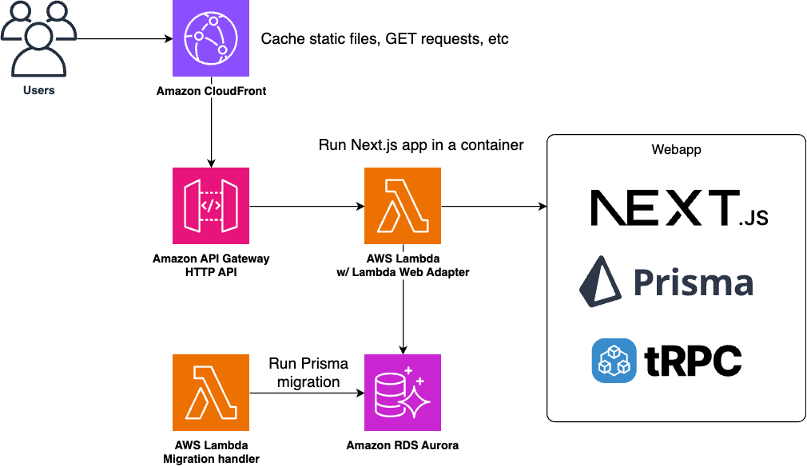

# tRPC + Next.js + Prisma on Lambda + CloudFront
[](https://github.com/aws-samples/trpc-nextjs-ssr-prisma-lambda/actions/workflows/build.yml)

> [!IMPORTANT]  
> This repository is being archived. For a more modern and improved fullstack web application sample, please refer to [serverless-full-stack-webapp-starter-kit](https://github.com/aws-samples/serverless-full-stack-webapp-starter-kit) instead.

This is a starter kit for a modern fullstack webapp on AWS. Features including:

* ✅ Next.js app with both server / client side rendering
* ✅ tRPC backend for end-to-end type safety
* ✅ Prisma to access your relational database easily
* ✅ React Hook Form with tRPC validation
* ✅ Lambda with Lambda Web Adapter for true serverless computing
* ✅ CloudFront for caching
* ✅ AWS CDK for one-click deployment

## Architecture
This sample deploys your Next.js application to AWS Lambda container environment. With [AWS Lambda Web Adapter](https://github.com/awslabs/aws-lambda-web-adapter), you can run the app transparently with Lambda and API Gateway pattern.



The advantage of using AWS Lambda is that it is fully serverless; you only pay when it received the actual requests. It is especially ideal for prototyping phase because you can use it with the minimal cost. At the same time, it is also ideal for production workload because it scales out in a few seconds according to the amount of requests.

All of the infrastructure parts are deployed in a single command with AWS Cloud Development Kit, allowing you to try this sample effortlessly.

## Deploy
You need the following tools to deploy this sample:

* [Node.js](https://nodejs.org/en/download/) (>= v18)
* [Docker](https://docs.docker.com/get-docker/)
* [AWS CLI](https://docs.aws.amazon.com/cli/latest/userguide/getting-started-install.html) and a configured IAM profile


Then run the following commands:

```sh
cd cdk
npm ci
npx cdk bootstrap
npx cdk deploy
```

Initial deployment usually takes about 20 minutes. You can also use `npx cdk deploy` command to deploy the app when you make changes to the code.

After a successful deployment, you will get a CLI output like the below:

```

 ✅  CdkStack

✨  Deployment time: 940.79s

Outputs:
CdkStack.DatabaseBastionHostBastionHostId1600F37C = i-0xxxxxxxxxxxxxx
CdkStack.DatabaseDatabaseSecretsCommandF4A622EB = aws secretsmanager get-secret-value --secret-id DatabaseClusterSecretD1FB63-xxxxxxxx --region ap-northeast-1
CdkStack.DatabasePortForwardCommandC3718B89 = aws ssm start-session --region ap-northeast-1 --target i-0xxxxxxxxxxxxxx --document-name AWS-StartPortForwardingSessionToRemoteHost --parameters '{"portNumber":["3306"], "localPortNumber":["3306"], "host": ["cdkstack-databasecluster5b53a178-4ont9k5raja4.cluster-xxxxxxxxx.ap-northeast-1.rds.amazonaws.com"]}'
CdkStack.MigrationFunctionName = CdkStack-WebAppMigrationRunner4FF0034F-wpE8B46If1um
CdkStack.WebAppCloudFrontUrlBAD6B277 = https://xxxxxxxxxxxx.cloudfront.net
CdkStack.WebAppMigrationCommandA625F170 = aws lambda invoke --function-name CdkStack-WebAppMigrationRunner4FF0034F-wpE8B46If1um --cli-binary-format raw-in-base64-out --payload '{"command":"deploy"}' response.json
Stack ARN:
arn:aws:cloudformation:ap-northeast-1:123456789012:stack/CdkStack/ecf45e70-a0a5-11ee-8ca1-0a8ebf670439
```

You can now try the sample app on your browser by opening the URL in `CdkStack.WebAppCloudFrontUrlBAD6B277` output. Let's try to post some comments.


## Usage
You can use this sample as a starter kit to develop a fullstack serverless webapp. Here are some tips to interact with this sample.

### Run a database migration
By default, a database migration is executed every time you run `cdk deploy` during CloudFormation deployment.

You can disable the behavior by commenting out the below code in [webapp.ts](cdk/lib/constructs/webapp.ts):

```diff
+   // comment out the trigger 
+   /*
    const trigger = new Trigger(this, "MigrationTrigger", {
      handler: migration,
    });
    trigger.node.addDependency(database.cluster);
+   */
```

Instead you can run a database migration manually. This is especially ideal if you want to separate a DB migration process from application deployment.

You can invoke the migration Lambda handler by the following command (`CdkStack.WebAppMigrationCommandA625F170` in the stack CLI output):

```sh
aws lambda invoke --function-name CdkStack-WebAppMigrationRunner4FF0034F-wpE8B46If1um --cli-binary-format raw-in-base64-out --payload '{"command":"deploy"}' response.json
```

Or you can run any SQL query from the bastion server by SSM port forwarding (`CdkStack.DatabasePortForwardCommandC3718B89`):

```sh
aws ssm start-session --target i-xxxxxx --document-name AWS-StartPortForwardingSessionToRemoteHost --parameters '{"portNumber":["3306"], "localPortNumber":["3306"], "host": ["cdkstack-databasecluster5b53a178-4ont9k5raja4.cluster-xxxxxx.ap-northeast-1.rds.amazonaws.com"]}'
```

The connection info for the Aurora database can be retrieved with the following command (`CdkStack.DatabaseDatabaseSecretsCommandF4A622EB`):

```sh
aws secretsmanager get-secret-value --secret-id DatabaseClusterSecretD1FB63-xxxxxx --region ap-northeast-1
```

Then you can connect your Aurora server by any tools like Sequel Ace, or by the following command:

```sh
mysql -u admin -p [PASSWORD]
```

### Add tRPC procedures
Because this sample uses a standard directory structure following tRPC official documents, you can basically follow [the document](https://trpc.io/docs/quickstart#defining-a-backend-router) to make changes to tRPC implementation.

The quick summary about where each tRPC definition example files is:

* [server.ts](./webapp/src/server/server.ts): tRPC app router definition
* [routers/**/index.ts](./webapp/src/server/routers/): the definition of each child router
* [common/types](./webapp/src/common/types/): the zod definition of router input, which can be referenced from both backend and frontend
* [components/post.tsx](./webapp/src/components/post.tsx): example implementation of tRPC client with React Hook Form

### Make use of CloudFront cache
To save Lambda cost and increase performance, it is important to use CloudFront to deliver contents that can be cached without accessing Lambda origin.

By default caching is enabled in some path patterns. Open [webapp.ts](cdk/lib/constructs/webapp.ts) and you can find this line:

```ts
    const cachedPathPatterns = ['/_next/static/*', '/favicon.ico', '/api/trpc/*'];
```

Add any path patterns you want to enable cache in CloudFront.

To actually use cache in CloudFront, you have to send `Cache-Control` response header from your app. See this document for more details: [Managing how long content stays in the cache (expiration)](https://docs.aws.amazon.com/AmazonCloudFront/latest/DeveloperGuide/Expiration.html).

Files in `_next/static` path should have appropriate `Cache-Control` headers by default.

For tRPC paths, you can set `Cache-Control` header in [`[trpc].ts`](./webapp/src/pages/api/trpc/[trpc].ts]) selectively for each path.

For Next.js public files, you can set `Cache-Control` header in [`next.config.js`](./webapp/next.config.js) for each file.

## Clean up
To avoid incurring future charges, clean up the resources when you no longer need them.

You can remove the AWS resources deployed by this sample running the following command:

```sh
cd cdk
npx cdk destroy --force
```

## Security
See [CONTRIBUTING](CONTRIBUTING.md#security-issue-notifications) for more information.

## License
This library is licensed under the MIT-0 License. See the LICENSE file.
